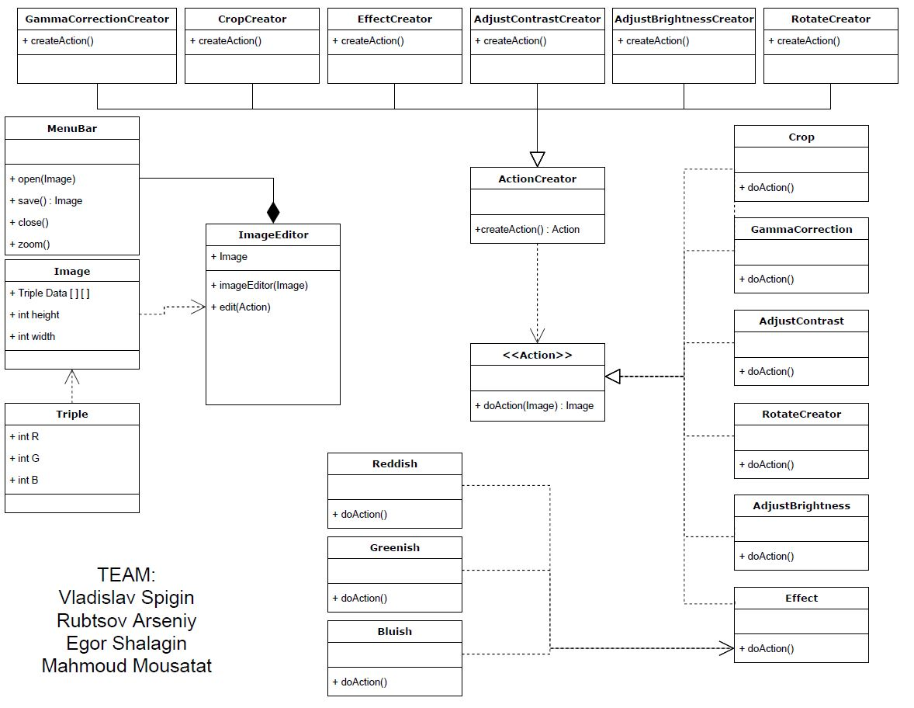

Our team was faced with the question of developing software that would allow us to modify photographs. For the development of this software it was decided to use the pattern factory, because the program itself must support many different functions-transformations of the image and in the future it should be convenient for adding new functions. In this case, the pattern factory will help us to easily expand our program in our future work by adding various new transformations to the image. The core of our program is ImageEditor, which takes the Image class, which will be further modified by various transformations. The ImageEditor class has two methods: the class constructor and the edit method, which takes an object of the Action class representing the action the user wants to perform on the picture. The ImageEditor class contains a menuBar class representing the opening, closing and application buttons (methods).  The Image class itself is a two-dimensional array of pixels (triples of colors), which must be changed after an action is performed on it.

In the UML diagram, the ActionCreator class acts as a factory, creating a transformation which will be later applied to the image. It helps simplify the creation of objects of the Action class, reducing it to a single function that returns an object of the class being created.

