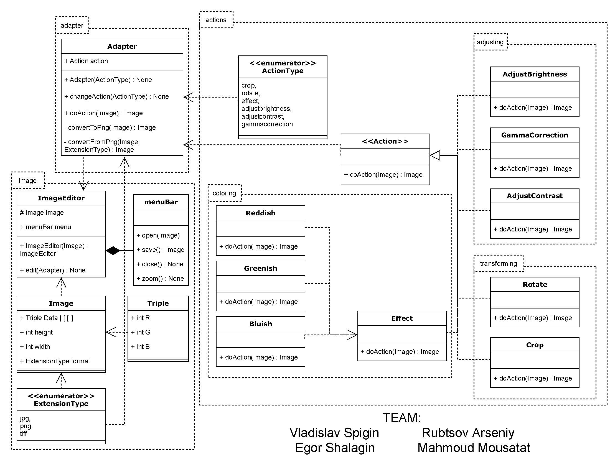

# Image Editor Project
Our team was faced with the question of developing software that would allow us
to modify photographs. To develop this software we decided to use the Adapter
pattern, because the program contained classes that could not interact directly due to
the peculiarities of the implementation.
#### Problem:
The peculiarities of the implementation are as follows, classes of actions, which
are located in the package actions (i.e. AdjustBrightness, GammaCorrection, Rotate
and others) can only process images in PNG format. The ImageEdter class, on the
other hand, must handle any picture format represented in the ExtensionType
enumerator.
#### Solution:
In our solution, the Adapter class is the intermediate link between the ImageEditor
class and the Actions class. Using the convertToPng and convertFromPng methods, it
converts the image into the PNG format, triggers the necessary action on the image
and returns the image in its original format.
#### More about details:

All elements, our solution contains: Action interface, enumerators ActionType,
ExtentionType and classes ImageEditor, Adapter, Image, menuBar, Triple,
AdjustBrightness, GammaCorrection, AdjustContrast, Rotate, Crop, Effect, Reddish,
Greenish, Bluish.

##### What parts of the program are used for:
* The ImageEditor class - the main class representing the application, all changes
to the images are made using it
* The menuBar class - part of the ImageEditor class representing the opening,
closing and application buttons (methods).
* Class Adapter – link used to connect ImageEditor and Actions.
* The Action interface and classes AdjustBrightness, GammaCorrection,
AdjustContrast, Rotate, Crop, Effect, Reddish, Greenish, Bluish - represent the
available transformations of the image, as well as they are divided into
packages based on the changes. Classes Reddish, Greenish, Bluish are
inherited from the class Effect as they perform similar actions, with different
parameters
* Enumerator ActionType - list of all available actions on an image, makes it
easy to switch the adapter between different actions
* Enumerator ExtentionType - list of all image formats handled, used in the
Image class to denote the format
* Class Image – representation of an image, containing all the image parameters
we need
* Class Triple – color settings used to simulate an image(work as RGB)

